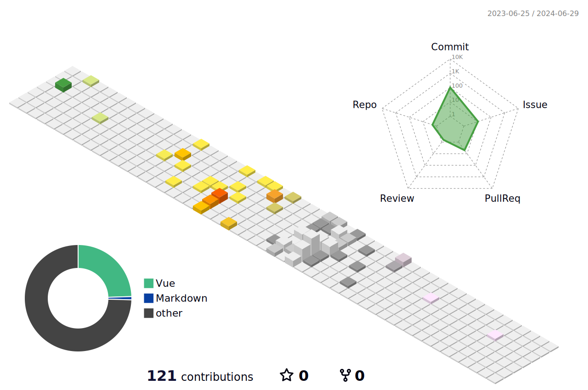

## 💫 About Me:
* 🔭 I'm currently working on **robotics with my school**
* 🌱 I'm currently learning **Go, Java, coding robots, WPILib, and C++**
* 💬 Ask me about **Go or p5js**
* ⚡ Fun fact: I wrote the [Learn X in Y minutes P5JS page](https://learnxinyminutes.com/docs/p5)

## 💻 Tech Stack:

### Languages I speak:

### Platforms I use:

### Stuff in my toolbox:

### Martial arts I know:

## 📊 GitHub Stats:

